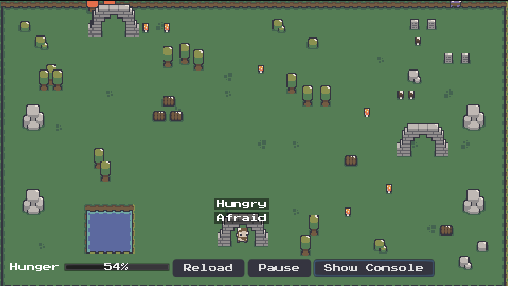

# Godot Goal Oriented Action Planning Example

This is the GOAP example implemented for [this video](https://youtu.be/LhnlNKWh7oc). If you have any comments and suggestion that video's comments section may
be the best place for them.

This is a personal experiment not tested in high load scenarios.
The code is fully documented to explain the reasoning behind the implementation.

You can find a live demo [here](https://viniciusgerevini.github.io/godot-goap).

The main branch works on Godot 4. For Godot 3, check the [godot_3](https://github.com/viniciusgerevini/godot-goap/tree/godot_3) branch. Godot 3 is the version shown in the demo video.

## What the example does

The main NPC (`./scenes/satyr.tscn`) needs to keep a firepit burning all the time.

This NPC has the following goals (higher numbers are higher priority):

- Keep Fire Pit Burning (priority 1)
- Keep Fed (priority 1 when hungry, 2 when very hungry)
- Calm Down (priority 10): When afraid
- Relax (priority 0): When there is nothing else to do

There is another NPC (not using goap), the Troll, which keeps wandering in the scene. If they get
too close to the Satyr, they enter in a frightned state.

## How it works

You can find all actions available at `./goap/actions/` and goals at `./goap/goals/`.

The `GoapAgent`(`./goap/agent.gd`) class integrates the NPC with the planner. It is responsible by requesting
plans and making sure the highest priority goal is being handled.

The `GoapActionPlanner`(`./goap/action_planner.gd`) is the heart of this implementation. When a plan is requested it first
creates a graph with all valid paths. Then it walks the graph building plans (list of actions) while summing their costs.
Finally, it returns the cheapest plan, which is executed by the agent.

In this implementation, I decided to have the action logic inside the action script. All actions have a `perform` method which receives an `actor` and a `delta`.
Maybe I was biased by my Behavior Tree implementation, but I like the idea of actions being stateless and not including low level details.

Check the scripts for comments with contextual information.

## Can I use this in my project?

I only own the code, assets are from [analogstudios_](https://analogstudios.itch.io/).

Feel free to use this code as you see fit. Keep in mind this is an experiment and many edge cases are not being handled. Some are commented in the code,
some others I might not have thought of. Also, I haven't tested it in stress situations.

There is no need for attribution. Anyway, in case you do something cool with it, let me know. I'd love to see it.

If you like this kind of content you might like my [youtube channel](http://youtube.com/c/ThisIsVini) or my [Twitter](https://twitter.com/vini_gerevini).

